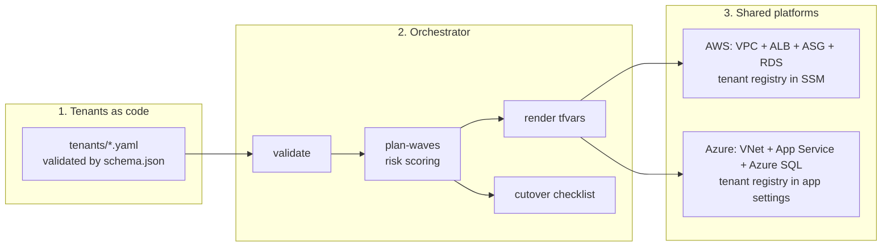

<div align="center">

# 🏭 Tenant Migration Factory

### Single-tenant sprawl goes in. A scalable multi-tenant cloud platform comes out.

[](https://github.com/TyroneMadison/tenant-migration-factory/actions/workflows/ci.yml)


</div>

---

## 💡 The problem this solves

SaaS platforms that grew customer by customer often end up with **one hand-built environment per customer**: some in AWS, some in Azure, some still on a server in the customer's building. At 10 customers that is annoying. At 100 it is untenable:

- 🔥 Every deployment is repeated per environment, by hand
- 🌀 Environments drift apart until no two are alike
- 💸 Idle single-tenant infrastructure burns money around the clock
- 🐢 Onboarding a new customer takes weeks instead of minutes

This is a common growing pain for regulated SaaS platforms, including those serving aerospace and defense supply chains, where legacy customer-hosted environments make it even harder.

**The factory flips the model.** One shared, hardened platform per cloud. Customers become *rows of configuration*, not stacks of infrastructure. Migration becomes a repeatable, risk-scored production line.

## 🗺️ How it works



1. **Every tenant is a YAML file** validated against a strict JSON schema. No tribal knowledge, no spreadsheet of doom.
2. **The orchestrator plans migration waves by scored risk.** Small cloud-hosted tenants prove the pipeline first. On-prem, compliance-flagged, tight-downtime tenants ride later waves, and ITAR/CUI/FedRAMP tenants are never allowed into wave 1.
3. **Terraform deploys one shared platform per cloud per environment.** Onboarding tenant 101 is a one-line map entry, not a new environment.

## 🚀 Quickstart

```bash
pip install -r orchestrator/requirements.txt

make validate     # schema-check every tenant definition
make waves        # print the risk-scored migration plan
make render       # emit per-tenant tfvars for the target stacks
make checklist TENANT=acme-aerosystems
make test         # 14 pytest cases covering the planning logic
```

Sample wave plan from the tenants in this repo:

```text
Wave 1
  orbitworks           risk  15  target azure
  vector-dynamics      risk  25  target aws
Wave 2
  acme-aerosystems     risk 120  target azure
      - source platform onprem (+40)
      - windows workload (+10)
      - sql server engine (+10)
      - database 180 GB (+20)
      - compliance flags itar,cui (+30)
      - downtime budget 30 min (+10)
```

## ☁️ One design, two clouds

| Concern | AWS stack | Azure stack |
| --- | --- | --- |
| Network isolation | VPC, public/private subnets, NAT | VNet, subnets, NSG rules |
| App tier | ALB + Auto Scaling Group | App Service (Linux) |
| Pooled database | RDS MySQL, encrypted, no public access | Azure SQL, TLS 1.2 floor |
| Tenant registry | SSM Parameter Store per tenant | App settings JSON registry |
| State isolation | S3 + DynamoDB lock per env | Storage container per env |
| Environments | dev / qa / staging / prod via tfvars + backend configs | same pattern, mirrored |

The two stacks share module boundaries on purpose: learn one, operate both. That is what cloud agnostic should mean in practice.

## 🗄️ The database story (the hard part)

Moving a single-tenant database into a pooled multi-tenant schema is where most migrations bleed. The factory treats it as versioned, rehearsable code:

- `db/migrations/` are Flyway-named, forward-only migrations for **MySQL and SQL Server**
- `V002` introduces `tenant_id` everywhere, `V003` makes it mandatory
- On SQL Server, **Row-Level Security** enforces tenant isolation even if an application query forgets its WHERE clause
- `db/runbooks/zero-downtime-db-cutover.md` keeps cutovers inside a 30 minute budget using pre-staged restores and log tail replay, with explicit rollback triggers
- `powershell/Test-MigrationReadiness.ps1` runs the go/no-go gate against legacy Windows + SQL Server sources: connectivity, version floor, backup freshness, disk headroom, pending reboots

## 🤖 Built AI-first, verified deterministically

This repo is written the way modern platform teams actually work now: AI pair engineering generates modules, tests, and docs together, then **deterministic gates decide what merges**: pytest, JSON schema validation of every tenant file, and `terraform validate` on both stacks in CI. `CLAUDE.md` encodes the repo contract so AI agents stay inside the guardrails. See `docs/ai-assisted-workflow.md`.

## 📁 Repository map

```text
tenants/            One YAML per tenant + JSON schema (single source of truth)
orchestrator/       Python package: loader, wave planner, renderer, checklist, CLI
tests/              pytest suite for the planning and rendering logic
terraform/aws/      Shared platform: VPC, ALB + ASG, RDS, SSM tenant registry
terraform/azure/    Shared platform: VNet + NSG, App Service, Azure SQL
db/migrations/      Flyway-style multi-tenant conversion (MySQL + SQL Server)
db/runbooks/        Zero-downtime cutover runbook with rollback triggers
powershell/         Source-environment readiness gate
docs/               Architecture, wave strategy, AI-assisted workflow
.github/workflows/  CI: pytest + tenant validation + terraform validate x2
```

## 🧭 Roadmap

- [ ] Drift detection between rendered tenant config and live platform (see the companion project **DriftGuard**)
- [ ] Terratest smoke deploys in an ephemeral account
- [ ] Azure Private Link for the pooled SQL tier
- [ ] Per-tenant cost attribution report from billing exports

## 📜 License

MIT. Built by **Tyrone Madison** as a working blueprint for migrating regulated, single-tenant SaaS estates into scalable multi-tenant cloud platforms.
