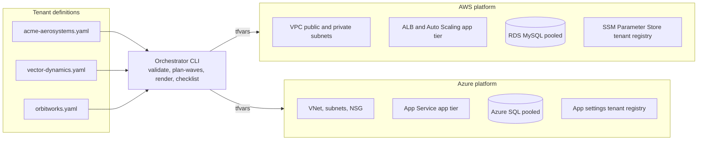

# Architecture

## The shape of the problem

Legacy model: every customer gets a hand-built environment. One hundred
customers means one hundred snowflakes across on-prem hosts and cloud
accounts. Deployments are manual, configuration drifts, and every new
customer adds permanent operational weight.

Target model: one shared, hardened platform per cloud per environment.
Customers exist as rows of configuration, not as infrastructure. Adding a
tenant is a pull request that touches one YAML file.

## Platform per cloud

Both stacks share the same module boundaries so an engineer who learns
one side can operate the other.

## Multi-environment state isolation

Each cloud and environment pair owns its own remote state:

* AWS: S3 bucket with DynamoDB locking, key path platform/aws/ENV.
* Azure: Storage account container, key path platform/azure/ENV.

Environments never share state, so a bad apply in dev cannot brick prod.
Backend settings ship as envs/ENV.backend.hcl files and are injected at
init time, which keeps the stacks free of hardcoded environment names.

## Tenant isolation inside the pooled database

Migration V002 introduces tenant_id everywhere, V003 makes it mandatory,
and on SQL Server the row-level security policy in
db/migrations/sqlserver/V003__row_level_security.sql guarantees isolation
even if an application query forgets its WHERE clause.

Premium and gov tier tenants can still land on dedicated database
instances: the tenant registry carries the routing decision, the platform
does not care.
